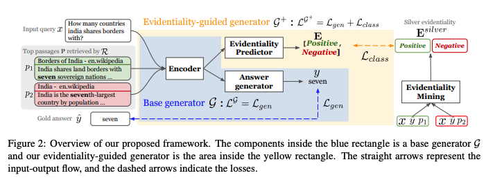
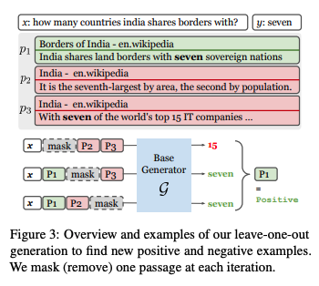

# Papers
- Summarization of related papers
- ```grey-background``` 
  - Quotes from other papers. Needs __paraphrasing__

## Main Idea
* [On the Role of Relevance in Natural Language Processing Tasks](https://dl.acm.org/doi/abs/10.1145/3477495.3532034)
  * Summary : 
    * ```Irrelevant results can be much more detrimental to the performance of the overall system because errors from retrieval can be magnified when propagate to the downstream system.```
    * ```Original Candidate Ranking is usually sub-optimal with low percision (FiD-Light)```
  * Use: 
    * Introduction for our paper (below just sketches)   
    In IR community, lots of progresses has been made by retrieving relevant results to query; however, researches how extra information considered to be relevant may cause harm to the downstream tasks have been actively studied only recently. In this perspective, we are adapting the damaging passage paradigm followed by [On the Role of Relevance in Natural Language Processing Tasks](https://dl.acm.org/doi/abs/10.1145/3477495.3532034) and show this concept is essential in Information Retrieval
  * Goal (or Results)
    * Showing damging passages results
    * Reduce the number of input passages to K -> fast inference
    * Achieve competitive result on downstream tasks -> compatible performance
      * Why downstream tasks?
        * (my personal conjecture) Removing damaging documents might lower the IR performance while increasing the downstream task performance.

## Dataset (KILT as main dataset)
* [FEVER: a large-scale dataset for Fact Extraction and VERification](https://arxiv.org/pdf/1803.05355.pdf)
* [The Fact Extraction and VERification (FEVER) Shared Task](https://arxiv.org/pdf/1811.10971.pdf)
* [KILT](https://arxiv.org/pdf/2009.02252.pdf)
* [FEVEROUS](https://arxiv.org/pdf/2106.05707.pdf)
* [BEIR: A Heterogenous Benchmark for Zero-shot Evaluation of Information Retrieval Models
](https://arxiv.org/abs/2104.08663)


## Retriever
* Bi-encoder Architecture
  * [DPR](https://arxiv.org/pdf/2004.04906.pdf)
    - Summary : Using Bi-encoder Architecture to retrieval relevant documents
    - Use : 
      - BERT based 
      - Many papers still use DPR as baseline retrieval module (very recent papers might not use)
      - Almost de-facto standard
      - Baseline Retriever for our experiment
  * [GTR:Large Dual Encoders Are Generalizable Retrievers](https://arxiv.org/abs/2112.07899)
    - Summary : Need to read
    - Use : 
      - T5 based
      - Retrieval module in [FiD-Light](https://arxiv.org/abs/2209.14290)
      - Used [BEIR: A Heterogenous Benchmark for Zero-shot Evaluation of Information Retrieval Models
](https://arxiv.org/abs/2104.08663) dataset
      - might be used for comparison for our paper
  * [Contriever: Unsupervised Dense Information Retrieval with
Contrastive Learning](https://arxiv.org/pdf/2112.09118.pdf)
    - Summary : Need to read
    - Use:
      - Retrieval module in [ATLAS](https://arxiv.org/abs/2208.03299)
      - might be used for comparison for our paper
      
* LM Architecture
  * [SEAL](https://arxiv.org/pdf/2204.10628.pdf)
    - Summary : Using LM to directly generate substrings in the corpus as identifiers
    - Use :
      - This could be fall into ablation sections
      - Instead of training LM models to generate golden passage directly, training LM models to generate relative passages obtained by our re-ranked passages sets, inspired by what was done in following MT(Machine Translation) papers.
        - [RMBR: A Regularized Minimum Bayes Risk Reranking Framework
for Machine Translation](https://arxiv.org/pdf/2203.00201.pdf)
        - [High Quality Rather than High Model Probability:
Minimum Bayes Risk Decoding with Neural Metrics](https://arxiv.org/pdf/2111.09388.pdf)
            - They corroborates that Log P generation (what LM models usually do) is not a good proxy for BLUE.
            - Translations with high BLUE scores are lower-ranked. 
            - So in order to enhance the quality in MT, they used high BLUE sentence for training
  * [GENRE](https://arxiv.org/pdf/2010.00904.pdf)
    - Summary : Need to read 
    - Use:
      - might be used for comparison for our paper
  * [CGR: Contextualized Generative Retrieval](https://arxiv.org/abs/2210.02068)
    - Summary : Need to read
    - Use:
      - `Contextualizatized` concept might be useful finding damaging passage
      - Paper introduced on 2022 SAIF

## Reader
* [FiD](https://arxiv.org/pdf/2007.01282.pdf)
  - Summary : Using LM Architecture to generate the answer from retrieved documents
  - Use : 
    - Many papers use FiD as default retrieval module 
    - Almost de-facto standard
    - Later works are based on FiD
* [FiD-Ex](https://arxiv.org/abs/2012.15482)
  * Summary : Need to read (but FiD-light incorporates FiD-Ex and shows better performance)
  * Use : 
    - used FiD model itself to explain which passage was selected for answer the query
      - input = Embedding from decoder("query: ";q;"index: ";i;"context"; $p_{i}$)
      - output = \[index : $\\{ r \mid r \in R^{+} \\}$, text : t\]

* [FiD-Light](https://arxiv.org/abs/2209.14290)
  * Summary : __Advanced FiD version with faster inference, higher performance.__
    * faster inference by compression to first-k vectors in encoding {query, index, context}
      * Reminds me of _ALBERT's factorized embedding parameterization (reducing embedding dimension)_
    * higher performance by using source pointers which was first proposed by [FiD-Ex](https://arxiv.org/abs/2012.15482) to __re-rank passages__ during inference 
      * Using OUTPUT of indices to __re-rank__ the candidate passage and then inference again.
  * Use:
    * they proposed `Oracle`, `Realistic Oracle` Experiment (could be referenced in our papar)
      * `Oracle` (row 5) : infuse only relevant passage (relevant passage means for gold passages, not the retrieved ones)
      * `Realistic Oracle` (row4) : infuse relevant passages to retrieved candidate list
    

* [ATLAS: Few-shot Learning with
Retrieval Augmented Language Models](https://arxiv.org/abs/2208.03299)
  * Summary : Need to read 
  * Use:
    - Current SOTA (described in the appendix section in [FiD-Light](https://arxiv.org/abs/2209.14290))
    - might be used for comparison for our paper

## Reranking (Previous Works)
 * [Evidentiality-guided Generation for Knowledge-Intensive NLP Tasks](https://arxiv.org/abs/2112.08688) 
   * Summary 
     * Introduces `evidentiality` concept to decide which passage contains correct evidence to support the output
       * __Very much similar__ to our paper
     * This research aims to remove irrelevant passages to an input query, that may cause learning spurious cues or memorization.
       * This may be looked as a similar objective as ours but our paper focuses on removing `damaging` passages, not the irrelevant ones
   * Use
     * Utilize multi-task learning framework of 1) answer generation and 2) evidentiality prediction
     
     * `leave-one-out` generation approach to get evidentiality data (label passages evidence/irrelevance)
     
       * Ours use `incremental` generation approach to get gold/damage/irrelevant label passages
       * Task-Agnostic : applicable to dataset where labels does not exist -> Also applies to our method
     * ```Our analysis (Appendix in Section A.1) shows that a base generator G trained in this manner often generates the answers from passages ranked  high by the retriever, which are not necessarily the  correct evidence passages.```
       * ```We found that the model often succeeds in retrieving the right evidence but fails to generate the answers based on the passages with supporting evidence.```
     * During training Model M(evidentiality label model), ```We also tried to fine-tune a simple binary classification
model using additional output layer on the top of T5 encoder. We found that this model performs much worse than
T5-decoder-based classification model.``` -> May be useful insight to train our model
     * Used DPR retrieved passages ->  can be used to directly compared to our results
     * Mentions hallucinations due to spurious passages -> [Attention-guided Generative Models for Extractive Question Answering](https://arxiv.org/abs/2110.06393), [Entity-Based Knowledge Conflicts in Question Answering](https://arxiv.org/abs/2109.05052)

 * [Distilling Knowledge from Reader to Retriever for Question Answering
](https://arxiv.org/abs/2012.04584)
   * Summary : Using distillation, retriever learns from reader's average cross-attention scores
     * Teacher : READER, Student : Retriever 
     * Using cross-attentions scores from Reader components(all layers FiD encoder layers)
   * Use:
     * Propose iterative training -> might be useful apply to our paper

 * [R2D2: Pruning the Index Contents for Memory Efficient Open-Domain QA](https://arxiv.org/abs/2102.10697)
   * Summary : Need to read (especially ranking part)
   * Use:
   
 * [Intra-Document Cascading: Learning to Select Passages for Neural Document Ranking](https://arxiv.org/abs/2105.09816)
   * Summary : Using distillation, apply ESM(student model) to select passages within documents and then utilize ETM(teacher model) to choose passages within selected ones
   * Use:
     * Provides two-stage method to train retrieval (vs DPR's negative batch sampling)
       * First training with passage level - loss binary cross-entropy loss (pairwise ranking) with negative samples
       * Second training with document level - loss binary cross-entropy loss 
     * Hypotheses why passage-level retrieval is more effective than document-level retrieval
       * `scope hypothesis` : ```the author covered multiple topics```
       * `verbosity hypothesis` : ```the author used more words to explain the topic```
     * Apply `CK` architecture on student model(ESM) 
       * CNN + Kernel 
       * CNN is used for avoiding using attention for efficiency
     * Sebastian Hofstätter 
       * one of [FiD-Light](https://arxiv.org/abs/2209.14290) authors
       * Sebastian Hofstätter's Reranking papers - https://sebastian-hofstaetter.github.io/

## Reranking(with entailment-Based(NLI) approach)
* [RECONSIDER: Improved Re-Ranking using Span-Focused Cross-Attention for Open Domain Question Answering](https://aclanthology.org/2021.naacl-main.100/)
  * Summary : Need to read 
  * Use:
* [Can NLI Models Verify QA Systems' Predictions?](https://arxiv.org/abs/2104.08731)
  * Summary : Summary: reformulate QA instances as premise-hypothesis pairs with high reliability
  * Use:
    * Involves 3 steps
      * answer generation : for NLI inference  
      * Question conversion 
        * reformulate qa instance to nli instance. 
        * That is using (q,a) to produce hypothesis (T-5)
      * Decontextualization 
        * rewrite the context (T-5)
        * $P(S_{d} | S_{a}, C)$ 
          * where $S_{a}$ is a sentence containing answer
          * $C$ is a context
          * $S_{d}$ is decontextualized output
        * why? inference over long format of text is challenging 

## Relevance (or Damaging)
* [On the Role of Relevance in Natural Language Processing Tasks](https://dl.acm.org/doi/abs/10.1145/3477495.3532034)
  * Summary : 
      * ```Irrelevant results can be much more detrimental to the performance of the overall system because errors from retrieval can be magnified when propagate to the downstream system.```
      * ```Original Candidate Ranking is usually sub-optimal with low percision (FiD-Light)```
  * Use: 
    * Introduction for our paper (below just sketches)   
    In IR community, lots of progresses has been made by retrieving relevant results to query; however, researches how extra information considered to be relevant may cause harm to the downstream tasks have been actively studied only recently. In this perspective, we are adapting the damaging passage paradigm followed by [On the Role of Relevance in Natural Language Processing Tasks](https://dl.acm.org/doi/abs/10.1145/3477495.3532034) and show this concept is essential in Information Retrieval
  * Goal (or Results)
    * Reduce the number of input passages to K -> fast inference
    * Achieve competitive result on downstream tasks -> compatible performance
      * Why downstream tasks?
        * (my personal conjecture) Removing damaging documents might lower the IR performance while increasing the downstream task performance.


## Hallucination in Reader
- [Attention-guided Generative Models for Extractive Question Answering](https://arxiv.org/abs/2110.06393)
  * Summary : Apply span prediction(extractive method) to FiD based on the attention score on Decoder
  * Use: 
    * This paper shows the way using attention mechanism on decoder side to avoid hallucination during inference
    * `Joint generative and extractive training`
      * Loss = (1 - alpha) * Training Generative Loss + alpha * Span Prediction Loss(based on attention score)
      * By doing this, we can force model to make predictions on the passage(contextual knowledge) using FiD architecture
      * Thereby, removing hallucination effects on the Reader.
    * `Attention Score as Reranker`
      * Also the define passage score using span prediction 
      * $$socre&#40; p_{i} | q&#41; \overset{\underset{\mathrm{def}}{}}{=} \sum_{t \in \left [q; p_{i}\right ]} P_{start}&#40;t&#41; \cdot \sum_{t \in \left [q; p_{i}\right ]} P_{end}&#40;t&#41; $$
  
- [Entity-Based Knowledge Conflicts in Question Answering](https://arxiv.org/abs/2109.05052)
  * Summary : Measure the over-reliance on memorized information (over-stability in parametric knowledge), which is the cause of hallucinations through entity-based conflicts in QA 
  * Use: 
    * Authors build the framework for creating knowledge-conflicting instances. Maybe we can use later
      * https://github.com/apple/ml-knowledge-conflicts
      * Proposed different substitution method
        * Corpus Substitution (CS)
        * Type Swap Substitution (TSS)
        * Popularity Substitution (PS)
        * Alias Substitution (AS)
    * Interesting characteristics
      * extractive QA models are affected as well (even though not as much as generative QA model)
      * When numeric entity (DAT, NUM) is replaced with a textaul(PER, ORG, LOC) one; at least 83% of the time the model predicts the Original Answer.
      * __Memorization can be mitigated by training a perfect retriever - the reader learns to trust the passage and ground its generation in this context__
      * In the absence of gold documents, we can use paper's method to mitigate memorization: augment the training set with training examples modified by corpus substitution

## Hallucination in Retrieval-augmented generation models ??

## MBR (in Machine Translation)
- [RMBR: A Regularized Minimum Bayes Risk Reranking Framework
for Machine Translation](https://arxiv.org/pdf/2203.00201.pdf)
- [High Quality Rather than High Model Probability:
Minimum Bayes Risk Decoding with Neural Metrics](https://arxiv.org/pdf/2111.09388.pdf)
  - They corroborates that Log P generation (what LM models usually do) is not a good proxy for BLUE.
  - Translations with high BLUE scores are lower-ranked. 
  - In order to enhance the quality in MT, they used high BLUE sentence for Machine Translation training


## Utility Functions for MBR (in Machine Translation)
  * [BLUERT](https://arxiv.org/pdf/2004.04696.pdf)
  * [COMET](https://arxiv.org/pdf/2009.09025.pdf)
    
## Papers (need to check)
### Retrievers (Paper introduced on 2022 SAIF)
- [DensePhrases: Learning Dense Representations of Phrases at Scale](https://arxiv.org/abs/2012.12624)
- [TRIME: Training Language Models with Memory Augmentation](https://arxiv.org/abs/2205.12674)
### Retrieval Augmented Models (Review Paper)
- [Retrieval-Enhanced Machine Learning](https://arxiv.org/pdf/2205.01230.pdf)
### Refernced Papers
- Omar Khattab, Christopher Potts, and Matei Zaharia. Relevance-guided supervision for openqa with
colbert. Transactions of the Association for Computational Linguistics, 9:929–944, 2021.
  - the representations of questions and documents
are obtained independently, leading to only shallow interactions captured between them
- Omar Khattab and Matei Zaharia. Colbert: Efficient and effective passage search via contextualized
late interaction over bert
  - the question or document representation is embedded into one single vector,
potentially missing fine-grained information when computing the similarity between the two vector
representations
  - [Long Transformers](https://huggingface.co/blog/long-range-transformers)
  - [Efficient Transformers: A Survey](https://arxiv.org/abs/2009.06732)

### Refernce papers - HallucinationRecallRate
[Attention is not Explanation](https://arxiv.org/abs/1902.10186)
[Attention is not not Explanation](https://arxiv.org/abs/1908.04626)
[FiE: Building a Global Probability Space by Leveraging Early Fusion in
Encoder for Open-Domain Question Answering](https://arxiv.org/pdf/2211.10147.pdf)

## Scribblings (Jotting down _ideas_ or _thoughts_ during reading papers)
* Each tasks(QA, Fact-Verification, Slot Filling, Dialogue) might need to define their own definition of relevance/damaging passages:
  * Example1. (QA setting) Who is the second to last president in the U.S.?
    * p1 : Donald J. Trump was the president of the United States from ~ to ~. -> relevant
    * p2 : Joe.Biden was elected as the president of the United States on ~ . -> damaging
  * Example2. (Fact Checking setting) Donald J. Trump is the current president of the United States.
    * p1 : Donald J. Trump was the president of the United States from ~ to ~. -> damaging
    * p2 : Joe.Biden was elected as the president of the United States on ~ . -> relevant