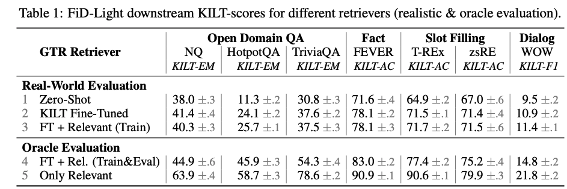
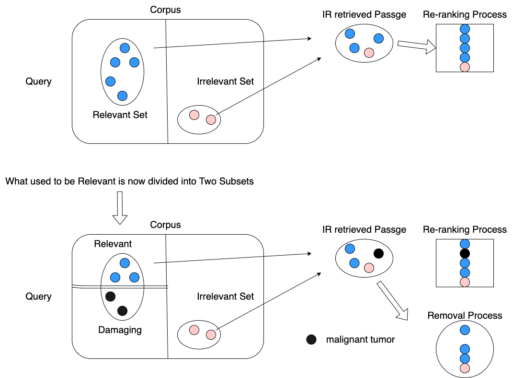
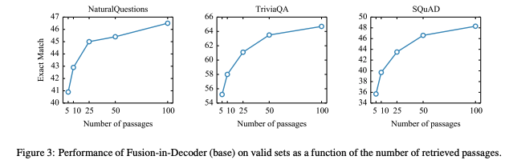

# relevance_retrieval
Information Retrieval relevance repository 

# Relevance Module in Information Retrieval

## Dataset
* [FEVER: a large-scale dataset for Fact Extraction and VERification](https://arxiv.org/pdf/1803.05355.pdf)
* [The Fact Extraction and VERification (FEVER) Shared Task](https://arxiv.org/pdf/1811.10971.pdf)
* [KILT](https://arxiv.org/pdf/2009.02252.pdf)
* [FEVEROUS](https://arxiv.org/pdf/2106.05707.pdf)
* [BEIR: A Heterogenous Benchmark for Zero-shot Evaluation of Information Retrieval Models
](https://arxiv.org/abs/2104.08663)

## Retriever
* Bi-encoder Architecture
  * [DPR](https://arxiv.org/pdf/2004.04906.pdf)
  * [GTR:Large Dual Encoders Are Generalizable Retrievers](https://arxiv.org/abs/2112.07899)
  * [Contriever: Unsupervised Dense Information Retrieval with
Contrastive Learning](https://arxiv.org/pdf/2112.09118.pdf)

* LM Architecture
  * [SEAL](https://arxiv.org/pdf/2204.10628.pdf)
  * [GENRE](https://arxiv.org/pdf/2010.00904.pdf)
  * [CGR: Contextualized Generative Retrieval](https://arxiv.org/abs/2210.02068)

## Reader
* [FiD](https://arxiv.org/pdf/2007.01282.pdf)
* [FiD-Ex](https://arxiv.org/abs/2012.15482)
* [FiD-Light](https://arxiv.org/abs/2209.14290)
* [ATLAS: Few-shot Learning with
Retrieval Augmented Language Models](https://arxiv.org/abs/2208.03299)

## Reranking (Previous Works) 
* [Evidentiality-guided Generation for Knowledge-Intensive NLP Tasks](https://arxiv.org/abs/2112.08688)
* [Distilling Knowledge from Reader to Retriever for Question Answering
](https://arxiv.org/abs/2012.04584)
* [R2D2: Pruning the Index Contents for Memory Efficient Open-Domain QA](https://arxiv.org/abs/2102.10697)
* [Intra-Document Cascading: Learning to Select Passages for Neural Document Ranking](https://arxiv.org/abs/2105.09816)

## Reranking(with entailment-Based(NLI) approach)
* [RECONSIDER: Improved Re-Ranking using Span-Focused Cross-Attention for Open Domain Question Answering](https://aclanthology.org/2021.naacl-main.100/)
* [Can NLI Models Verify QA Systems' Predictions?](https://arxiv.org/abs/2104.08731)

## Relevance (or Damaging)
* [On the Role of Relevance in Natural Language Processing Tasks](https://dl.acm.org/doi/abs/10.1145/3477495.3532034)

## MBR (in Machine Translation)
- [RMBR: A Regularized Minimum Bayes Risk Reranking Framework
for Machine Translation](https://arxiv.org/pdf/2203.00201.pdf)
- [High Quality Rather than High Model Probability:
Minimum Bayes Risk Decoding with Neural Metrics](https://arxiv.org/pdf/2111.09388.pdf)

## Utility Functions for MBR (in Machine Translation)
  * [BLUERT](https://arxiv.org/pdf/2004.04696.pdf)
  * [COMET](https://arxiv.org/pdf/2009.09025.pdf)
  
## Hallucination in Retrieval-augmented generation models
- [Attention-guided Generative Models for Extractive Question Answering](https://arxiv.org/abs/2110.06393)
- [Entity-Based Knowledge Conflicts in Question Answering](https://arxiv.org/abs/2109.05052)

## Papers (need to check)
### Retrievers (Paper introduced on 2022 SAIF)
- [DensePhrases: Learning Dense Representations of Phrases at Scale](https://arxiv.org/abs/2012.12624)
- [TRIME: Training Language Models with Memory Augmentation](https://arxiv.org/abs/2205.12674)
### Retrieval Augmented Models (Review Paper)
- [Retrieval-Enhanced Machine Learning](https://arxiv.org/pdf/2205.01230.pdf)

## Architectures
- Architecture sketches
- We may apply different ranking model architecture proposed in other papers

## Oracle Experiment
* `Oracle` (row 5) : infuse only relevant passage (relevant passage means for gold passages, not the retrieved ones)
* `Realistic Oracle` (row4) : infuse relevant passages to retrieved candidate list
* `Real-World Evaluation` (row3) : Trained with retrieved candidate list

### Damaging Passage Paradigm (malignant negatives)

### Suggestion : Incremental Generation ('Incremental Oracle', 'Real-World Incremental Evaluation')
* `Realistic Oracle` & `Real-World Evaluation` does not fully exploit READER component because of the existing damaging passages in retrieved candidate list
* In order to prove the existence of damaging passages, doing incremental evaluation
  * `Incremental Generation` 
    * starting with top-1 passages doing evaluation and then top-2, top-3 and top-k.
    * So for each query, we will have k trials
    * If at least one trials success, mark it as success. Otherwise, regard it as fail (`cumulative k-retrieval EM`  described below)
      * e.g.)
        * query1 : 10000 -> 1
        * query2 : 01011 -> 1
        * query3 : 00001 -> 1
        * query4 : 00000 -> 0
        * Then the normal `EM` for top-5 retrieval is (0110) = 50.0
        * `cumulative k-retrieval EM` for top-5 retrieval is (1110) = 75.0
          * Finding '10' pattern supports the existence of damaging passages   
  * Metrics
    - `k-retrieval EM`
      - calculate EM using all k-retrieved contexts
    - `cumulative k-retrieval EM`  
      - calculate EM using cumulatively 1 ~ k retrieved contexts. If one of k attempts succeeds, mark them as success in EM
    - `10 pattern conversion ratio per instance(query or question)`
      - if EM shows `10` meaning that the right inference in the previous step was negatively impacted by current step 
      - The high conversion ratio points out the retrieval quality of discerning positive context to the damage context
      - the lower the better for the reader
    - Showing gap between `5-retrieval EM` and `cumulative 5-retrieval EM` will give us the primary purpose of the research. 
      - main topic of research : 
        > Irrelevant results in information retrieval can be much more detrimental to the performance of the overall system. Therefore, we introduce the idea of damaging passages with respect to query to avoid this downside-effects in cascading IR-NLP system. 
    
### Incremental Oracle set-tup
* `Realistic Oracle` + `Incremental Generation` 
  * Assumption : if damaging passage exists, there would be `10` pattern
  * So `Incremental Oracle` set-up performance result would be lower than `Oracle`
  * So `Incremental Oracle` set-up performance result would be higher than `Realistic Oracle`

### Incremental Real-World set-tup
* `Real-World Evaluation` + `Incremental Generation` 
  * Assumption : if damaging passage exists, there would be `10` pattern
  * So `Incremental Real-World` set-up performance result would be lower than `Realistic Oracle`
  * So `Incremental Real-World` set-up performance result would be higher than `Real-World Evaluation`

### Fid's `Real-World EvaluationQA`

- 5 number of passages
  - NQ : EM (around) 41
  - Trivia QA : EM (below) 56
  - SQuAD v1.1 : EM 36

## Strategies with damaging passages and example Cases for `Incremental Generation`
- `10` pattern proves that extra passages damages the output, which is our assumption
- There would be lots of stratigies dealing with these pattern but here, briefly describe the basic ideas.

### Method 1

- Example figures for setting k = 5 for k-retrieval passages
  - Using FiD to get the EM 

- Case1
  - Case WHEN adding extra passages deteriorates the EM (using 1st context only vs using 1st, 2nd contexts in the case1 figure)
  - This case supports the damaging contexts
- Case2
  - Case WHEN previous selected passages are not appropriate
  - This case demonstrates the retrieval needs re-ranking system
- Case3
  - Case WHEN using all k-retrieval passages fail, but using only portion of passages gives the right answer
  - This case represents gap between `Real-World Evaluation` and `Incremental Real-World` for top-5 retrieval.
    - __Although they have sufficient amount of information (retrieval top-5 passages), reader generates the wrong one due to the existence of damaging passages__

- Score Function 
  - Basic Assumption here is `damaging` passages do have same down-side effects as `irrelvant` passages -> Assumptions of other papers 
  - `damaging` candidates : `zero`
  - `irrelevant` candidates : `zero`
  - `relevant` candidates : scores assigned by 'positive values' weighted by order
  
- Score Mechanism Usages
  - This can be later used in training relevance module for reranking (apply reranking after retrieval)
  - This can be later used in training embedding regressor in order to use trained regressor as utility function in MBR
  - Sentences with high reranking score might be used for training LM Model(such as SEAL) directly as described in `Architectures 3. LM Architecture (advanced)`
    - So that LM models learn the ranking scores (no need for re-ranking step!)
  - Sentences with high reranking score can be trained on bi-encoder architecture directly.
    - Injecting re-ranking scores in bi-encoder architectures (no need for re-ranking step!)
  - How it works
    - 1st context showing Exact Match will have score of 1 divided by k (1/5)
    - 2nd context along with previous context will have score 1/2 divided by k (1/10)
    - This will give the same score with in accordance with its order
      - 1st context shows the EM -> 1/5
      - 2nd context shows the EM -> 1/10
    - Contexts that fail will be assigned to zero
    - Scores range from 0 to 1/k (later can be rescaled to 0 ~ 1 using min/max scaling or standardization)
    - As k increases, scores will be smoothed 
  
### Method 2

- Same ideas with Method1 but with different score function
- Score Function 
  - Basic Assumption here is damaging passage do more harms to irrelevant -> fits to our research
  - `damaging` candidates : scores assigned by `negaive values` weighted by order to `damaging` candidates
  - `irrelevant` candidates : `zero`
  - `relevant` candidates : scores assigned by 'positive values' weighted by order

### Method 3

- Same ideas with Method1 but with different score function
- Score Function 
  - Basic Assumption here is that `relvant` passages mitigating the downside effects of `damaging` passages are more resilient. Thus giving them more weights by accumulation  
  - `damaging` candidates : scores assigned by `negaive values` weighted by order to `damaging` candidates + score of the very before `relevant` candidate multiplied by -1
  - `irrelevant` candidates : `zero`
  - `relevant` candidates : scores assigned by 'positive values' weighted by order + score of the very before `damanging` candidate multiplied by -1
  